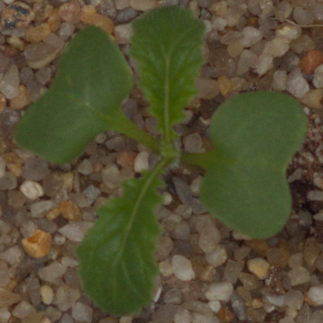
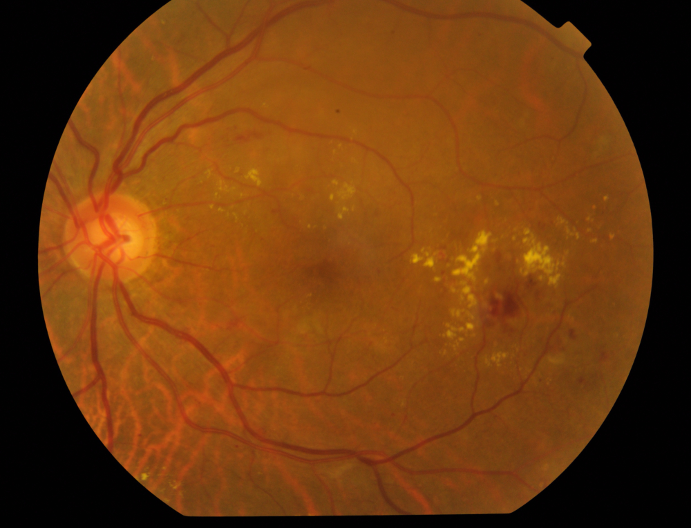

# Kaggle Competition Notebooks
A collection of my submissions for different Kaggle competitions. I'm a novice when it comes to Kaggle competitions so most of these may be fairly pedestrian attempts, however, often a simple method is sufficient.

For image classification tasks my usual starting framework is [fast.ai](https://www.fast.ai/), due to it's simplicity, and the fact that it usually just works great. If you haven't used it before I'd highly recommend it, especially for beginners to the deep learning space.

For most of these I'll use [Weights and Biases](https://www.wandb.com/) to track the model runs. It draws pretty graphs for you, saves all your code/config, and saves the best model (lowest validation loss) for each run. 

# Image Classification

## [Plant Seedlings Classification](https://www.kaggle.com/c/plant-seedlings-classification)

Given an image of a plant seedling, classify it into one of 11 types of seedling.

[Notebook](plant-seedlings/plant-seedlings.ipynb)

[WandB Project](https://app.wandb.ai/basedrhys/plant-seedlings?workspace=user-basedrhys)

### Score

- Private - 0.984
- Public - 0.984
- Ranking - 77/834

Fortunately, this dataset is fairly easy, and so a simple approach works well.

## [APTOS 2019 Blindness Detection](https://www.kaggle.com/c/aptos2019-blindness-detection)

This competition tasks competitors with detecting the severity of diabetic retinopathy in patients - how bad is their blindness. This is typically done via expert analysis of eye images, so this competition looks to see if we can achieve similar performance with ML.

[Notebook](aptos-2019/aptos-2019.ipynb)

[WandB Project](https://app.wandb.ai/basedrhys/aptos-2019?workspace=user-basedrhys)

### Score

- Private - 0.89
- Public - 0.71
- Ranking - 1105/2931

This is most definitely a more difficult dataset, and the standard of competition is very high (almost 3000 competitors!). More sophisticated approaches are needed to get up the ranks.

